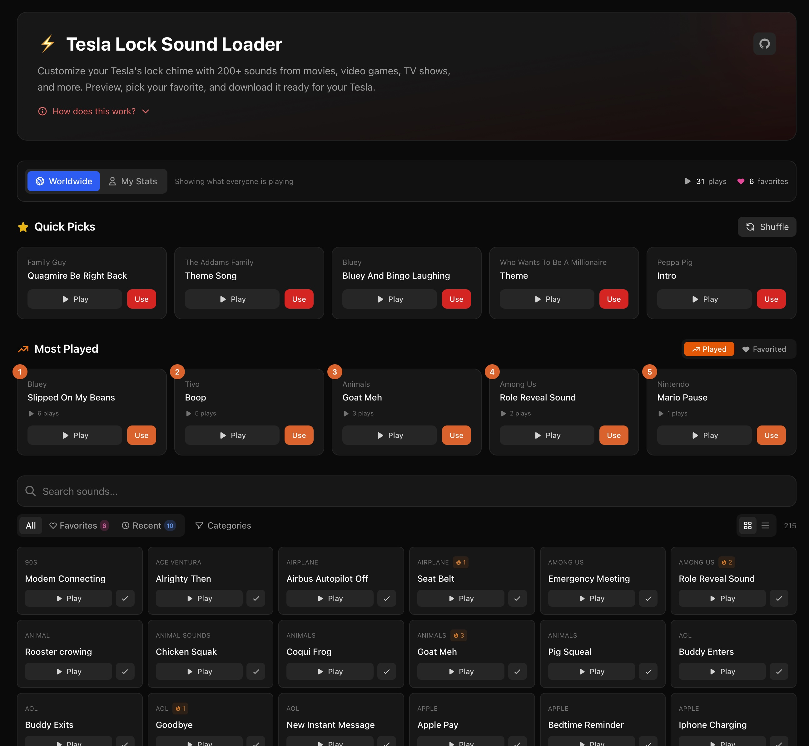

# Tesla Lock Sound Loader

[](https://teslausbloader.pages.dev)
[](#)
[](#license)

A web app for browsing, previewing, and downloading custom lock sounds for your Tesla. Choose from 200+ sounds including movies, video games, cartoons, and more.

> **Sound Source:** All sounds courtesy of [Not a Tesla App](https://www.notateslaapp.com/tesla-custom-lock-sounds/) - this is an unofficial browser for their excellent curated collection.

**Live Site:** [teslausbloader.pages.dev](https://teslausbloader.pages.dev)



---

## Features

- **200+ Sounds** - Movies, games, cartoons, TV shows, retro sounds
- **Instant Preview** - Click to play any sound
- **Quick Picks** - Random suggestions with shuffle
- **Most Popular** - See what the community loves
- **Favorites** - Save sounds you like
- **Search & Filter** - Find sounds by name or category
- **Worldwide Stats** - Track plays, downloads, favorites
- **Offline Support** - Cache sounds for offline access
- **Auto-Updated** - New sounds synced automatically

---

## Quick Start for Tesla Owners

1. **Browse** the sounds at [teslausbloader.pages.dev](https://teslausbloader.pages.dev)
2. **Preview** sounds by clicking the play button
3. **Download** your favorite as `LockChime.wav`
4. **Copy** the file to the root of your USB drive
5. **Plug** the USB into your Tesla's glovebox port
6. **Activate** via Toybox → Boombox → Lock Sound → USB

> **Requirements:** Tesla with Pedestrian Warning System (2019+ models), FAT32 USB drive

---

## Tech Stack

| Component | Technology |
|-----------|------------|
| Frontend | React + TypeScript + Vite |
| Styling | Tailwind CSS |
| Hosting | Cloudflare Pages |
| API | Cloudflare Workers |
| Database | Cloudflare KV |
| CI/CD | GitHub Actions |

---

## Development

```bash
# Clone the repo
git clone https://github.com/rvwrh29585-eng/teslausbloader.git
cd teslausbloader

# Install and run
cd web
npm install
npm run dev
```

See [ABOUT.md](./ABOUT.md) for complete documentation including:
- Full developer setup guide
- Project architecture
- API documentation
- AI agent game plan for rebuilding from scratch

---

## Project Structure

```
├── .github/workflows/     # Automated sound sync
├── functions/api/         # Cloudflare Workers (API)
├── scripts/               # Sync scripts
├── sounds/                # 215+ WAV files
├── web/                   # React frontend
├── script.sh              # Original CLI version (deprecated, see below)
├── ABOUT.md               # Complete documentation
└── README.md              # This file
```

### About `script.sh`

The project started as a Bash CLI tool using `gum` for TUI before being rewritten as a web app. The original `script.sh` is preserved for reference but is no longer maintained. It demonstrates:
- Scraping with `htmlq`
- TUI menus with `gum`
- Audio preview with `afplay`
- USB detection with `diskutil`

See [ABOUT.md](./ABOUT.md) for the full evolution story.

---

## How This Was Built

This entire project was built collaboratively with an AI assistant (Claude). The process included:

1. Started with a Bash script for scraping sounds
2. Evolved into a full web app with React + Cloudflare
3. Added features iteratively based on user feedback
4. Documented everything for reproducibility

See the [AI Agent Game Plan](./ABOUT.md#ai-agent-game-plan) in ABOUT.md for step-by-step instructions to rebuild this project from scratch.

---

## Contributing

Contributions welcome! Feel free to:
- Report bugs or request features via Issues
- Submit PRs for improvements
- Suggest new sounds to add

---

## Sound Source & Credits

> **All sounds are sourced from [Not a Tesla App](https://www.notateslaapp.com/tesla-custom-lock-sounds/).**
> 
> This project is an unofficial browser/loader for their excellent curated collection of Tesla lock sounds. All credit for collecting, optimizing, and maintaining the sound library goes to the [Not a Tesla App](https://www.notateslaapp.com) team.

### Additional Credits

- Built with [Claude](https://claude.ai) AI assistance
- Hosted on [Cloudflare Pages](https://pages.cloudflare.com)

---

## License

MIT License - see [LICENSE](./LICENSE) for details.

---

<p align="center">
  <strong>⚡ Made for Tesla owners who want a personal touch ⚡</strong>
</p>
